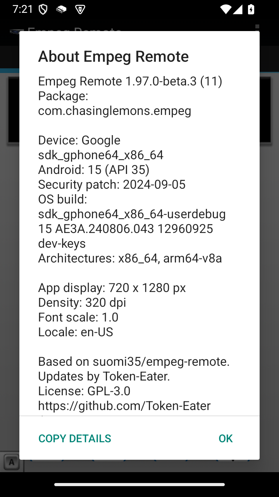
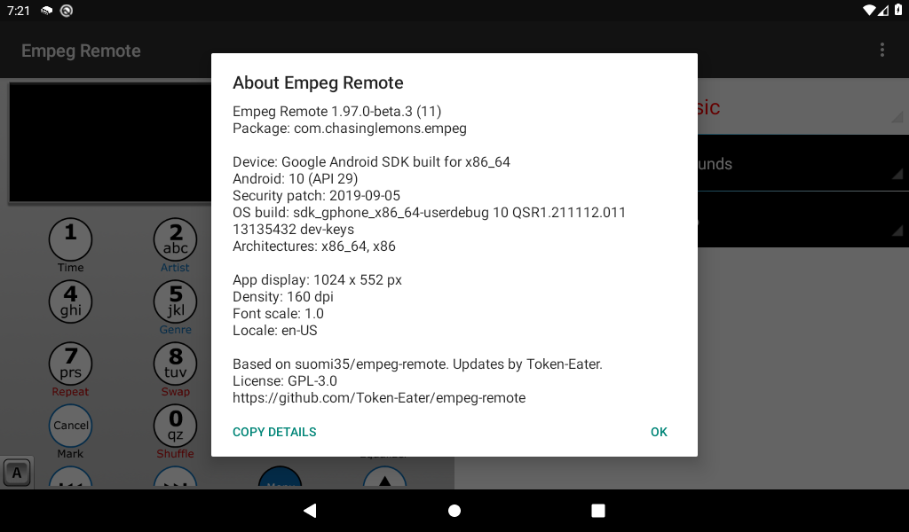

# Empeg Remote 1.97.0-beta.3 preview

**Awaiting review; this beta has not been published.**

The new **About** item is available from the main menu and the player-selection menu. It shows the installed app version and useful Android troubleshooting details. **Copy details** copies the complete report, including any text below the visible area, without closing the dialog.

The report includes manufacturer/model, Android version/API, security patch, OS build, CPU architectures, app display dimensions/density, font scale and locale. It uses no additional permissions and does not collect device serials, account information or network identifiers. Nothing is uploaded automatically.

## Phone layout — Android 15 emulator

Actual screenshot at 720 × 1280. The report scrolls; the Copy details and OK buttons stay accessible.

[Open full-size phone screenshot](images/beta3-about-phone.png)

## Tablet layout — Android 10 emulator

Actual screenshot at 1024 × 600.

[Open full-size tablet screenshot](images/beta3-about-tablet.png)

## Testing and installation

Checked on both emulators and a physical Lenovo TB330XU running Android 15. Copying was verified by pasting the complete report into an unsent message and cancelling. Build, four unit tests and lint passed; existing legacy lint warnings remain. No physical Android phone was tested.

Version code 11. The signed APK updates beta 1 or beta 2 without uninstalling or losing settings. Publication will follow review of this preview.

See [release validation](../../RELEASE_VALIDATION.md) for the detailed test record.
